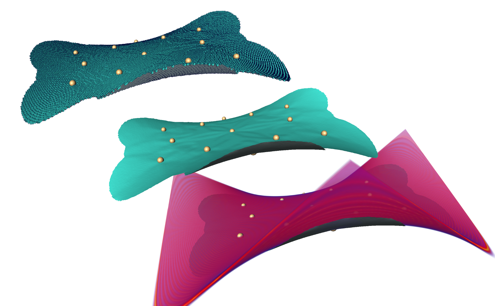
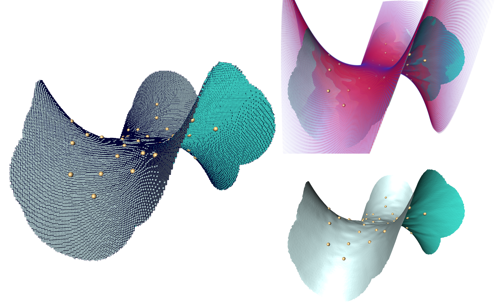

# Cubical Ridge Surface Finder

This repositrory contains the source code used to calculate a cubibal ridge surface, described in the paper [A Local Iterative Approach for the Extraction of 2D Manifolds from Strongly Curved and Folded Thin-Layer Structures](https://arxiv.org/abs/2308.07070). A ridge surface can be seen as a generalized version of an isosurface.Given a scalar field, each point inside the ridge surface is a local maxima point in the direction of the ridge surface. Cubical means that the surface is voxelized i.e. the surface only consists of faces of the voxels of the scalar field (see images).

## Installation

To compile, one should use cmake with features of c++23 or newer.

From the root of the project:
```
cmake -S . -B build/ -D CMAKE_BUILD_TYPE=Release
cmake --build build/
```

## Usage

```
build/tests
build/examples monkey-saddle
build/rsf [numpy-input-path] [seedpoints-input-path] [flags]
```

See `build/rsf --help` for more information on flags. 

### Input Files

A scalar field as a numpy file and a list of seedpoints (3D points) are necessary.
The seedpoints are either:
- in wavefront format (only the vertices are read)
- labels in a numpy file (all labels >0 are seen as seedpoints)
- lines of 3D points (see [examples](data/examples/smelt-petal_seeds.obj))

As numpy files do not contains spatial information of a scalar field, they may be added either in the console (see `--help`) or via a metadata txt file with the same name as the numpy file. See [Metadata README](docs/README_Metadata.md) for more information.

## Examples

Example fields and surfaces can be generated with the built `examples` executable.
Images show the Smelt Petal and the Monkey Saddle example with the original output, a smoothed version and the smooth surface overlayed with the volume rendering of the scalar field.




## Folder and File Structure

- src: contains the source code library
- includes: extern libraries used in this project and included with the project for ease of installation and use
- main.cxx: entry point for the terminal program
- test.cpp: entry point for the test program, created with catch2

## License

This project is licensed under a Creative Commons Attribution-NonCommercial-ShareAlike 4.0 International License.
You should have received a copy of the license along with this work.  If not, see [CC BY-NC-SA](https://creativecommons.org/licenses/by-nc-sa/4.0/).